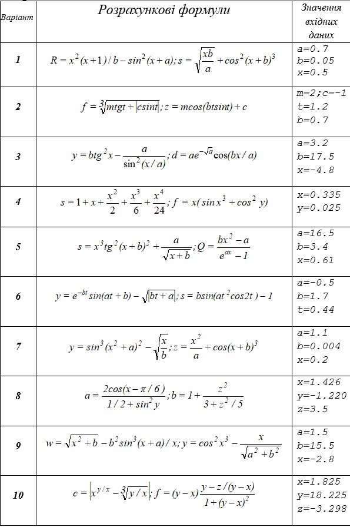

= Лабораторна робота №2 - Функції

Функцією в програмуванні називається закінчена ділянка програми, що вирішує певне завдання -
зазвичай це частина великого завдання, яке вирішує програма в цілому,
хоча в простих випадках написання програми зводиться до написання однієї функції.
Як і у функції в математичному сенсі, у функції в програмуванні є входи (параметри), вихід (результат)
і визначення, яке вказує, як розраховується значення виходу за заданим значенням входів.

Визначення простих функцій на Котліні мало відрізняється від визначення математичних функцій.
Розглянемо для прикладу математичну функцію sqr(x) = x^2^.
На Котліні вона буде записана так:

[source,kotlin]
----
fun sqr(x: Int) = x * x
// або
fun sqr(x: Double) = x * x
----

В цьому визначенні **fun** - це __ключове слово__, з якого починається визначення будь-якої функції в Котліні;
**fun** є скороченням від function -- функція.
`sqr` -- це __ім'я__ функції, `x` -- __параметр__ функції,
`= x * x` -- __тіло__ функції, яке визначає, як треба обчислити її __результат__.
Ім'я функції разом з її параметрами та ключовим словом **fun** називається її __заголовком__.

Оскільки __операція__ обчислення квадрату числа в Котліні відсутня, результат обчислюється як добуток `x*x`.

== Математичні функції

У бібліотеці Котліна визначена велика кількість математичних __функцій__,
які призначені для виконання більш складних операцій.
Для прикладу їхнього використання розглянемо задачу розв'язання квадратного рівняння ax^2^ + bx + c = 0.

Нагадаємо, що корені квадратного рівняння шукаються за формулою x~1,2~ = (-b &plusmn; &radic;d) / (2a),
де d -- дискримінант квадратного рівняння -- обчислюється як d = b^2^-4ac.
Ми розв'яжемо цю задачу в спрощеному вигляді -- знайти будь-який з двох можливих коренів, скажімо, той,
в якому в чисельнику використовується знак плюс.

Для початку напишемо функцію для розрахунку дискримінанту (вона ще знадобиться нам у майбутньому).
Для розрахунку b^2^ використаємо **вже написану** вище функцію `sqr(x: Double)`.

[source,kotlin]
----
fun discriminant(a: Double, b: Double, c: Double) = sqr(b) - 4 * a * c
----

В цьому фрагменті  `b` є __аргументом__ функції `sqr`.
Запис виду `sqr(b)` називається __викликом__ функції `sqr`.
Підкреслимо відмінність __параметру__ та __аргументу__ -- параметр визначається **всередині** функції та має визначене ім'я,
в даному випадку `x`,
а аргумент передається в функцію **ззовні** та може бути як іменем змінної, так і більш складним __виразом__.

Тепер напишемо функцію для пошуку кореня квадратного рівняння.
Для обчислення квадратного кореня застосуємо існуючу математичну функцію `sqrt(x: Double)`
з математичної біблиотеки Котліна.

[source,kotlin]
----
fun quadraticEquationRoot(a: Double, b: Double, c: Double) =
        (-b + sqrt(discriminant(a, b, c))) / (2 * a)
----

Тут ми, в свою чергу, використовуємо **вже написану** функцію `discriminant` для пошуку дискримінанту,
і вираз `discriminant(a, b, c)`, тобто дискримінант рівняння, є __аргументом__ функції `sqrt`.
Це саме той випадок, коли аргумент є складним __виразом__.

== Змінні в функціях

Вище ми розглянули приклади з функціями `sqr` та `discriminant`
обчислення результату в яких займало один рядок коду.
Проте, в програмуванні це - скоріш рідкий випадок;
частіше розрахунок результату функції передбачає реалізацію деякої послідовності обчислень -- алгоритму.
Для збереження результатів **проміжних** обчислень програмісти вигадали __змінні__.

Розглянемо, наприклад, задачу обчислення **добутку** двох коренів квадратного рівняння.
Нагадаємо, що корені квадратного рівняння обчислюються як (-b+&radic;d)/(2a) та (-b-&radic;d)/(2a) відповідно,
де d -- дискримінант квадратного рівняння.
При обчисленні добутку зручно спочатку зберегти обчислений корінь з дискримінанту у змінній `sd`,
через те, що він використовується при обчисленні обох коренів.
Після того треба обчислити обидва кореня `x1` та `x2` і вже потім розрахувати їхній добуток.
На Котліні це записується таким чином:

[source,kotlin]
----
fun quadraticRootProduct(a: Double, b: Double, c: Double): Double /* тип обов'язковий */ {
    // Тіло функції у вигляді блока
    val sd = sqrt(discriminant(a, b, c))
    val x1 = (-b + sd) / (2 * a)
    val x2 = (-b - sd) / (2 * a)
    return x1 * x2 // Результат
}
----

В цьому прикладі тіло функції записано у вигляді __блоку__ в фігурних дужках,
в протилежність тілу в вигляді __виразу__ -- як в функціях `sqr` и `discriminant` вище.
Знак рівності при цьому прибирається та обов'язково вказується тип результату функції.
В прикладі присутні три проміжні __змінні__ -- `d`, `x1`, `x2`.
Визначення проміжної __змінної__ в Котліні починається з __ключового слова__ **val**
(скорочення від value -- значення), за яким іде ім'я змінної та, після знака рівності -- її значення.
За бажанням можна також указати тип змінної, наприклад:

[source,kotlin]
----
    // ...
    val sd: Double = sqrt(discriminant(a, b, c))
----

Якщо тип змінної не вказаний, він визначається автоматично, наприклад,
в даному випадку він співпаде з типом результату функції `sqrt`.

Блок складається з так званих __операторів__ (в прикладі їх чотири), що виконуються по порядку згори донизу.
**Перед** використанням будь-якої змінної, її слід визначити. Наприклад, такий запис призвів би до помилки:

[source,kotlin]
----
fun quadraticRootProduct(a: Double, b: Double, c: Double): Double {
    val x1 = (-b + sd) / (2 * a) // Unresolved reference: sd
    val x2 = (-b - sd) / (2 * a) // Unresolved reference: sd
    val sd = sqrt(discriminant(a, b, c))
    return x1 * x2 // Результат
}
----

Останній оператор функції, що починається з __ключового слова__ **return**, визначає значення її результату;
**return** перекладається з англійської як **повернути** (результат).
Функція `quadraticRootProduct` в першу чергу обчислить значення змінної `sd`,
використовуючи **інші функції** `discriminant` та `sqrt`.
Потім відбудеться обчислення змінних `x1` та `x2` і лише в кінці -- обчислення результату в операторі **return**.

Для порівняння, наведемо запис тієї ж функції, що не використовує змінні:
[source,kotlin]
----
fun quadraticRootProduct(a: Double, b: Double, c: Double) =
        ((-b + sqrt(discriminant(a, b, c))) / (2 * a)) * ((-b - sqrt(discriminant(a, b, c))) / (2 * a))
----

Хоча і записана в один рядок, така функція є набагато менш зрозумілою,
при її написанні легко заплутатись при розстановці дужок.
Крім того, в ній відбувається двократне обчислення кореня з дискримінанту, чого слід уникати.

== Функція println та рядкові шаблони

Розглянемо приклад -- функція, що розв'язує квадратне рівняння та демонструє розв'язки користувачеві.

[source,kotlin]
----
fun solveQuadraticEquation(a: Double, b: Double, c: Double) /* no result */ {
    val sd = sqrt(discriminant(a, b, c))
    val x1 = (-b + sd) / (2 * a)
    val x2 = (-b - sd) / (2 * a)
    // Виведення на екран значень x1 та x2
    println(x1)
    println(x2)
    // Виведення на екран рядку вигляду x1 = 3.0 x2 = 2.0
    println("x1 = $x1 x2 = $x2")
    // Виведення на екран добутку коренів
    println("x1 * x2 = ${x1 * x2}")
}
----

Ми підійшли до такої важливої частини програмування,
як взаємодія з користувачем та взагалі з зовнішнім для програми світом.
Зверніть увагу -- тепер функції, які ми використовуємо, починають відрізнятися від чисто математичних,
оскільки у них з'являються __побічні ефекти__ (side effects).
Функція в програмуванні в загальному випадку не зводиться __лише__ до залежності між параметрами та результатом.

Функція `println(p)` визначена в стандартній бібліотеці мови Котлін та не потребують підключення будь-яких пакетів.
Її параметр `p` може мати будь-який тип --
так, виклик `println(x1)` виведе на окремий рядок __консолі__ значення змінної `x1`.
Найчастіше, проте, `p` є рядком, наприклад, `"x1 = $x1 x2 = $x2"`.
В цьому рядку присутні рядкові шаблони `$x1` та `$x2`, що складаються з символа **$** та імені змінної (параметра).
Замість них програма автоматично підставить значення відповідних змінних.
Рядковий шаблон дозволяє також підставити значення складного виразу,
як, наприклад, тут: `"x1 * x2 = ${x1 * x2}"`.
В цьому випадку вираз записується в фігурних дужках, щоб програма мала можливість відслідкувати його початок та кінець.

Зверніть увагу, що тип результату функції `solveQuadraticEquation` не вказаний.
Це означає, що функція **не має** результату (в математичному сенсі).
Такі функції зустрічаються доволі часто, один з прикладів -- сама функція `println`,
та їхній реальний результат зводиться до їхніх побічних ефектів -- наприклад, виведення на консоль.

Залишилось визначити -- що саме є __консоль__?
У звичній нам операційній системі Windows __консоль__ -- це вікно або його частина,
яку програма використовує для виведення текстової інформації.
В Intellij IDEA це вікно можна відкрити послідовністю команд `View` -> `Tool windows` -> `Run`.
При запуску програми з операційної системи, вона сама відкриє так зване "вікно терміналу",
яке буде використовуватися програмою для виведення текстової інформації.

== Тестові функції

Тестові функції -- особливий вид функцій, які призначені для перевірки правильності роботи інших функцій.
Оскільки людині властиво помилятися, програмісти винайшли чимало способів,
як можна проконтролювати правильність програми, як своєї власної, так і написаної іншими людьми.
Тестові функції є одним з таких способів. Розглянемо приклад:

[source,kotlin]
----
// Дозвіл на використання короткого імені анотації org.junit.jupiter.api.Test
import org.junit.jupiter.api.Test
// Дозвіл на використання короткого імені для функції org.junit.jupiter.api.Assertions.assertEquals
import org.junit.jupiter.api.Assertions.assertEquals

// Класс Tests, наявність класу обов'язкова для бібліотеки JUnit
class Tests {

    // ...

    // Тестова функція
    @Test
    fun testSqr() {
        assertEquals(0, sqr(0))  // Перевірити, що квадрат нуля це 0
        assertEquals(4, sqr(2))  // Перевірити, що квадрат двух це 4
        assertEquals(9, sqr(-3)) // Перевірити, що квадрат -3 це 9
    }
}
----

Написання тестових функцій вимагає підключення до програми однієї з бібліотек автоматичного тестування,
наприклад, бібліотеки **JUnit**
Більшість класів цієї бібліотеки знаходяться в пакеті `org.junit` для версії JUnit 4.x або
в пакеті `org.junit.jupiter.api` для версії JUnit 5.х.

`@Test` - це так звана __аннотація__, тобто, позначка, яка використовується для надання функції` testSqr`
додаткового сенсу. В даному випадку, анотація робить функцію `testSqr` тестовою.
Функція `assertEquals` призначена для порівняння результату виклику деякої іншої функції,
наприклад, `sqr`, з тим, що очікується. У наведеному прикладі вона викликається тричі.

Тестових функцій в проекті може бути багато, будь-яка з них запускається так само, як і головна функція -
натисканням зеленого трикутника зліва від заголовка функції.
Тестові функції виконуються за тими ж принципами, що і будь-які інші,
але виклики `assertEquals` відбуваються особливим чином:

* Якщо перевірка показала збіг результату з очікуваним, функція не робить нічого;
* В іншому випадку виконання тестової функції завершується і в IDEA з'явиться повідомлення, виділене червоним кольором,
про невдале завершення тестової функції.

Якщо тестова функція завершила роботу і результати всіх перевірок співпали з очікуваними,
тестова функція вважається завершеною успішно.

Нарешті, що ж таке `class Tests`?
За правилами бібліотеки JUnit, всі тестові функції повинні бути присутніми всередині деякого __класу__.
Про те, для чого потрібні класи, ми поговоримо пізніше.
В даному прикладі для цієї мети був створений клас з ім'ям `Tests` (ім'я може бути довільним),
і тестова функція була записана в ньому.
Зелений трикутник навпроти імені класу дозволяє одночасно запустити всі тестові функції в даному класі.

Будь-яка написана програма або функція **завжди** вимагає перевірки.
Ця вимога тим важливіше, чим складніше програма або функція.
Тестові функції дозволяють довести правильність роботи перевіряється функції, щонайменше,
для деяких значень її аргументів.

Поряд з тестовими функціями, може бути використано і __ручне__ тестування.
Ручне тестування передбачає виведення результатів функції на консоль і ручну перевірку їх з очікуваними.
Для ручного тестування може бути використана головна функція, наприклад:

[source,kotlin]
----
fun main() {
    println("sqr(0) = ${sqr(0)}")
    println("sqr(4) = ${sqr(4)}")
}
----

В нормальному випадку ми повинні побачити на консолі рядки

----
sqr(0) = 0
sqr(4) = 16
----

Ручне тестування є набагато більш трудомістким і вимагає від програміста або тестувальника набагато більшої уваги.
Тому в сучасному програмуванні рекомендується починати перевірку функцій зі створення тестових функцій,
які запускаються кожен раз при зміні програми і дозволяють помітити чи з'явилися помилки.
Ручне тестування виконується значно рідше, зазвичай перед випуском нової __версіі__ програми.
Але це зовсім інша історія...

== Завдання
Відкрийте файл `Main.kt`
Знайдіть у ньому описи заголовків функцій для свого варіанту.

Наприклад, для 1 варіанту - це будуть функції

[source,kotlin]
----
fun var1calcR(a: Double, b: Double, x: Double) : Double = TODO()
fun var1calcS(a: Double, b: Double, x: Double) : Double = TODO()
----

Замість `TODO()` опишіть реалізацію цих функцій.
Перейдіть до класу тестових функцій `MainKtTest` та виконайте тестування ваших функцій за допомогою відповідних функцій
цього класу.

Якщо функції тестування показали, що у Вас є помилки - виправте їх (свої помилки, не функції!) та повторіть тестування

